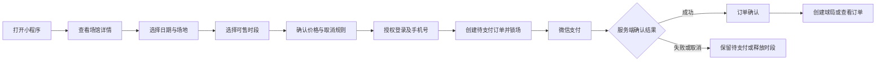
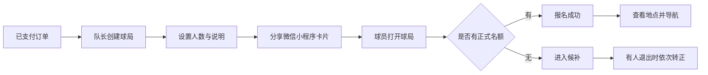
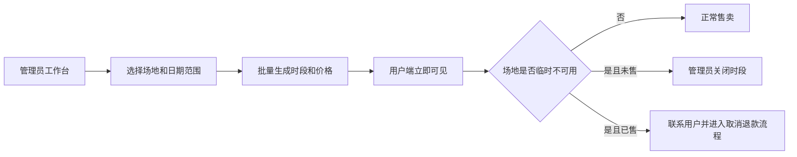
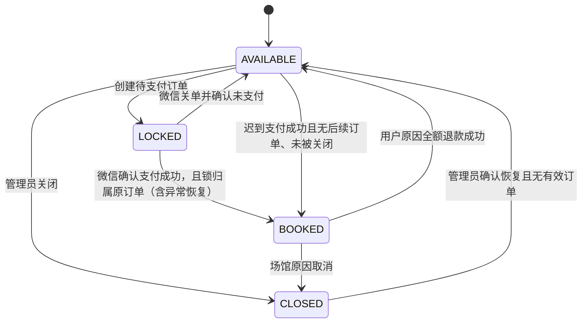
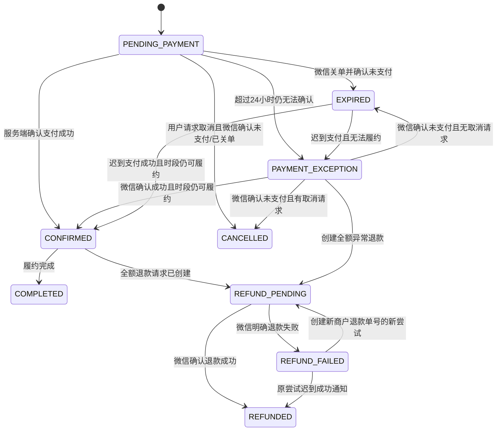
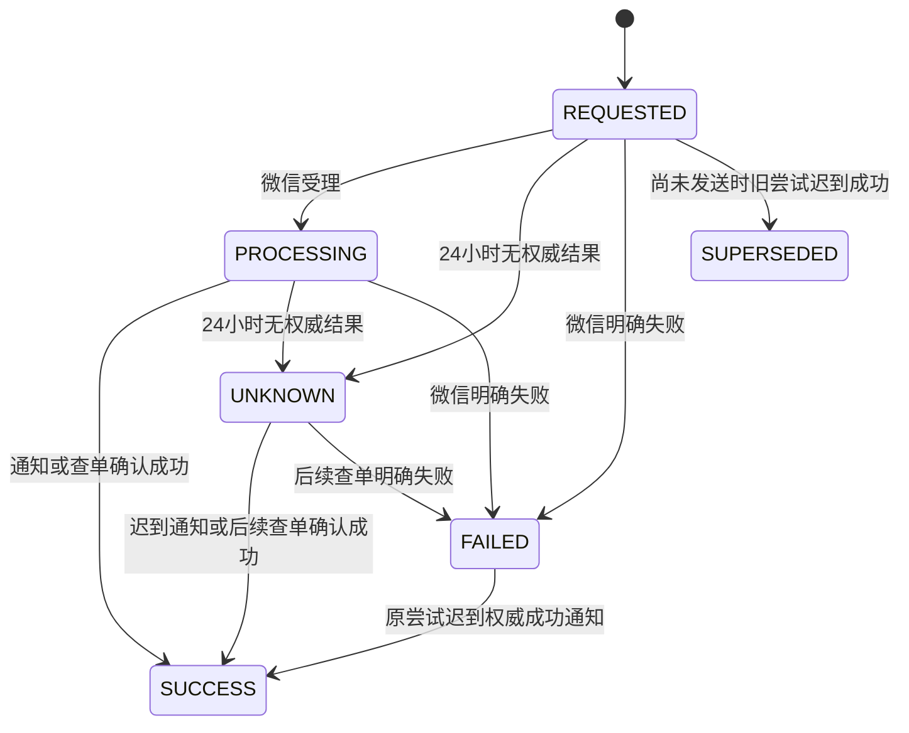
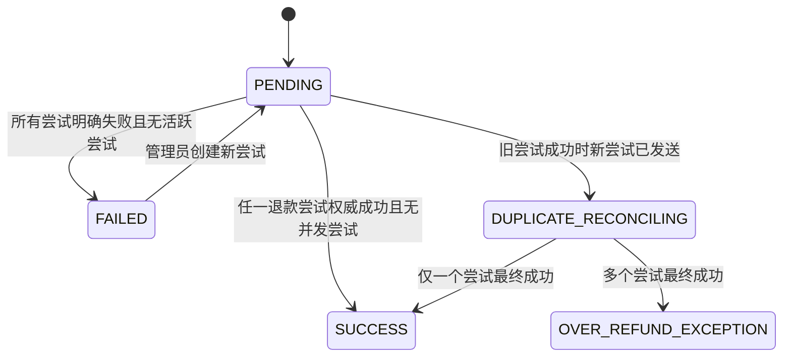

# 天津足球场预订小程序初版 PRD

| 项目 | 内容 |
| --- | --- |
| 文档版本 | v1.0 |
| 日期 | 2026-07-21 |
| 产品阶段 | 单场馆 MVP / 灰度版 |
| 首发区域 | 天津市西青区 |
| 首发品类 | 五人制、七人制足球场 |
| 客户端 | 原生微信小程序 |
| 后端 | FastAPI + PostgreSQL，部署于现有阿里云 Linux 服务器 |
| 产品主体 | 平台方公司 |
| 支付模式 | 队长向平台支付整场费用；球员报名不在平台内 AA 付款 |
| 文档状态 | 产品范围与业务规则已确认；场馆内容参数须在对应页面联调前录入 |

## 1. 产品摘要

本项目拟开发一个面向天津业余足球队长和球员的微信小程序。初版只服务一个位于天津市西青区、由合作方运营的足球场馆，提供以下完整闭环：

> 查看场馆与空闲时段 → 队长预订整场并支付 → 创建球局 → 分享至微信群 → 球员报名或候补 → 到场履约 → 必要时申请退款。

初版的核心目的不是建设全国性体育社交平台，而是验证三个商业假设：

1. 通过线上展示、微信分享和队长运营，可以给位置稍远但价格、质量和停车条件有优势的场馆带来增量订单。
2. 队长愿意使用结构化工具完成订场、分享和报名管理。
3. 单场馆形成真实订单与复购后，可以把成功案例复制给天津其他足球场馆。

## 2. 背景与机会

首家合作场馆当前付费利用率低于 10%，主要原因包括：

- 距离天津中心城区较远；
- 潜在用户知晓度低；
- 预订和组局主要依赖熟人、电话及微信群；
- 没有统一展示空闲时段、价格和场地条件的线上入口。

场馆具备三项可用于抵消距离劣势的条件：

- 价格相对市区更有竞争力；
- 场地质量和规格较好；
- 停车方便，适合固定球队训练、约战和企业活动。

项目当前拥有的冷启动资源包括：

- 一家可完全配合线上试点的样板场馆；
- 场馆方认识部分固定球队和队长；
- 可触达天津足球微信群、业余俱乐部或联赛资源；
- 平台方具备自主开发和维护软件的能力。

## 3. 产品目标

### 3.1 初版产品目标

- 让队长在 3 分钟内完成场地查询和订单支付。
- 让队长在支付后 1 分钟内创建并分享球局。
- 让球员无需下载 App，通过微信群中的小程序卡片完成报名。
- 让场馆管理员只使用微信小程序即可维护未来 7—14 天的库存和价格。
- 保证同一场地、同一时段不会被重复售卖。
- 支持服务端确认支付、订单查询和原路退款。
- 沉淀真实的订单、队长、复购和时段利用率数据。

### 3.2 商业验证目标

产品公开灰度后的首个 8 周，以以下指标作为继续投入和接入更多场馆的参考门槛：

| 指标 | 目标 |
| --- | ---: |
| 有效队长数 | ≥ 30 |
| 付费订场订单 | ≥ 50 |
| 发生二次付费预订的队长 | ≥ 15 |
| 非黄金时段付费利用率 | 从低于 10% 提升至 20% 以上 |
| 支付成功订单履约率 | ≥ 95% |
| 因平台库存错误造成的超卖 | 0 |
| 支付及退款账实不符 | 0 |

“有效队长”指至少创建过一笔真实订单，或创建并分享过真实球局的用户。

### 3.3 非目标

初版不以以下事项为目标：

- 建设完整体育社交网络；
- 覆盖篮球、羽毛球、健身房等其他品类；
- 支持商家自主注册入驻；
- 支持多商家自动结算和平台分账；
- 替代微信群聊天；
- 提供联赛、排名、水平算法或推荐算法；
- 开发 iOS 或 Android 独立 App；
- 依靠信息流广告大规模获客。

## 4. 用户角色

### 4.1 队长 / 订场人

核心用户和付款人，通常每周或每月组织固定球队活动。

主要需求：

- 快速知道什么时间有空场；
- 明确价格、位置、停车和场地质量；
- 确保付款后场地真实锁定；
- 快速把球局分享到微信群；
- 查看报名、候补和缺口；
- 在取消时知道是否能退款。

### 4.2 普通球员

由队长通过微信群带入小程序，不负责整场付款。

主要需求：

- 查看球局时间、地点、人数和说明；
- 一键报名或退出；
- 满员后进入候补；
- 打开地图导航；
- 联系队长或场馆。

### 4.3 场馆管理员

由合作场馆指定，可维护场地和处理订单。

主要需求：

- 批量创建可售时段；
- 调整未售时段价格；
- 临时关闭场地；
- 查看当天订单和到场信息；
- 确认到场；
- 处理取消与退款；
- 查看基础经营数据。

### 4.4 平台管理员

由平台方指定，拥有全局管理和问题排查权限。

主要需求：

- 配置场馆管理员；
- 查看全部订单、支付和退款记录；
- 处理异常订单；
- 查看操作日志和业务指标；
- 配置平台协议、客服电话和基础规则。

初版可由同一管理界面承载场馆管理员和平台管理员，并通过角色限制具体操作。

## 5. 核心用户流程

### 5.1 订场流程



### 5.2 组局与报名流程



### 5.3 管理员维护库存流程



## 6. 功能范围与需求

需求优先级定义：

- **P0**：初版上线必需；
- **P1**：应尽量在灰度期完成，但不阻塞首次内部试用；
- **P2**：后续版本候选，初版不开发。

### 6.1 登录与账户

#### AUTH-01 游客浏览（P0）

用户未登录时可以浏览：

- 场馆详情；
- 场地类型；
- 日期和时段状态；
- 价格；
- 球局公开信息。

创建订单、创建球局、报名和管理操作必须登录。

**验收标准：**首次打开小程序时不强制手机号授权，也能看到场馆和空闲时段。

#### AUTH-02 微信登录（P0）

- 小程序通过微信登录获取临时凭证；
- 后端换取微信用户唯一标识；
- 后端创建用户并签发自己的会话令牌；
- 微信密钥只保存在服务端。

**验收标准：**同一微信账号重复登录对应同一平台用户。

#### AUTH-03 手机号授权（P0）

- 用户首次创建订单时必须提供手机号；
- 确认订单页要求用户手工填写联系人姓名，允许 2—30 个中英文字符、数字、空格、间隔点或连字符，不允许纯空白；
- 手机号通过微信手机号能力获取后展示脱敏值，用户如需使用其他号码，可重新授权，不提供任意文本手机号输入；
- 联系人姓名在用户确认后保存为用户最近一次订场联系人，下次可预填并允许修改；
- 创建订单时保存联系人姓名和手机号快照；
- 普通球员报名默认不强制手机号，未来可根据运营需要调整。

**验收标准：**缺少有效姓名或手机号的用户不能创建订单；用户修改个人资料不会改变历史订单的联系人快照。

#### AUTH-04 管理员权限（P0）

- 管理员由平台后台白名单配置；
- 普通用户看不到管理员入口；
- 后端必须再次校验权限，不能只依赖前端隐藏按钮。

### 6.2 场馆与场地展示

#### VENUE-01 场馆首页（P0）

展示：

- 场馆名称；
- 主图和场地实拍图；
- 价格优势说明；
- 五人制、七人制等场地类型；
- 营业时间；
- 详细地址；
- 停车说明；
- 更衣、照明、饮水等设施；
- 联系电话；
- 取消和退款规则摘要。

#### VENUE-02 地图导航（P0）

- 保存场馆准确经纬度；
- 调用微信地图能力打开导航；
- 不在初版自建地图或路线规划服务。

**验收标准：**从场馆详情和订单详情均可打开正确地图位置。

#### VENUE-03 联系场馆（P0）

- 用户可一键拨打场馆客服电话；
- 电话号码由管理员配置；
- 订单详情同时展示客服电话和订单编号。

### 6.3 可售时段

#### SLOT-01 日期与时段查询（P0）

- 默认且初版固定展示今天起未来 14 天；
- 支持按日期和场地类型切换；
- 显示开始时间、结束时间、价格和状态；
- 仅可选择 `AVAILABLE` 状态的时段。

用户端时段状态：

- 可订；
- 暂时锁定；
- 已订；
- 不可用。

#### SLOT-02 批量生成时段（P0）

管理员可按以下维度批量生成：

- 日期范围；
- 星期；
- 场地；
- 开始和结束时间；
- 价格。

系统应提示并跳过重复时段，不得默默覆盖已有订单。

- 同一场地的两个时段只要时间区间相交，即视为冲突，不允许生成；
- 例如 18:00—20:00 与 19:00—21:00 不允许同时存在；
- 初版将每个 `pitch` 视为可独立售卖的物理场地，不支持“一个七人场拆成两个五人场”等共享资源组合；
- 数据库必须使用时间范围排斥约束或等价的事务校验防止区间重叠，不能只在前端校验；
- 管理员单次最多生成未来 31 天内的时段，但普通用户只看到未来 14 天。

**验收标准：**同一场地重复或重叠时段均创建失败，并返回冲突时段；不同独立场地的相同时间允许同时售卖。

#### SLOT-03 修改与关闭（P0）

- 未产生有效订单的时段可修改价格或关闭；
- 已支付时段不能直接修改时间、价格或场地；
- 已支付时段需要关闭时，必须先进入订单取消与退款流程；
- 所有管理员修改应写入操作日志。

#### SLOT-04 价格规则（P0）

- 金额统一以人民币“分”为服务端存储单位；
- 下单价格以服务端当前价格为准；
- 创建订单后保存价格快照；
- 前端提交的金额不得作为计价依据。

初版不实现会员价、优惠券、节假日规则和动态定价。

### 6.4 订单与库存

#### ORDER-01 创建待支付订单（P0）

- 一个订单只购买一个场地时段；
- 创建订单时服务端锁定对应时段；
- 默认支付有效期为 10 分钟；
- 用户重复点击不得产生多个可支付订单；
- 同一用户对同一时段已有有效待支付订单时，应返回原订单。

#### ORDER-02 防止超卖（P0）

- 创建订单必须在 PostgreSQL 事务中完成；
- 使用行锁或等价数据库并发控制；
- 同一时段最多只能关联一个有效锁定或已支付订单；
- 锁定过期后才允许其他用户重新下单。

**验收标准：**至少 20 个并发请求预订同一时段时，只能产生一个有效订单。

#### ORDER-03 待支付超时（P0）

- 用户支付倒计时为 10 分钟；订单超过倒计时后对用户显示“正在关闭支付”，不能立即把时段重新出售；
- 后台补偿任务先向微信查单：若已成功则确认原订单；若未支付则请求关单，并在确认微信订单为 `CLOSED` 后将本地订单变为 `EXPIRED`；
- 只有微信订单已关闭或从未创建微信预支付单时，对应时段才能重新可售；
- 用户返回过期订单时不得再次直接支付，应重新确认库存和价格。

**迟到支付规则：**

- 微信确认迟到支付成功时，满足以下任一安全条件即可恢复原订单：①时段仍为 `LOCKED` 且 `locked_by_order_id` 就是原订单；②时段为 `AVAILABLE`、没有关联后续有效订单且未被管理员关闭；
- 恢复时必须在同一事务中把原订单从 `EXPIRED` 或 `PAYMENT_EXCEPTION` 改为 `CONFIRMED`，并把原订单独占的 `LOCKED` 或安全的 `AVAILABLE` 时段改为 `BOOKED`；
- 时段为 `CLOSED`，或 `LOCKED`/`BOOKED` 的归属是其他订单时，均视为不可履约，不得恢复原订单或覆盖后续订单；原订单标记为 `PAYMENT_EXCEPTION`，平台自动创建全额退款并告警；
- 支付关闭、查单、释放库存和异常退款都必须幂等。

**验收标准：**仅本地时间过期不会直接释放已生成微信支付单的库存；原订单仍独占 `LOCKED` 时，迟到支付成功可正常恢复；时段已被其他订单占用时不会产生两个可履约订单。

#### ORDER-03A 待支付主动取消（P0）

- 用户取消待支付订单时，系统写入 `cancel_requested_at`，订单在微信结果确定前仍保持 `PENDING_PAYMENT`，客户端显示“正在取消”；
- 如果尚未创建微信预支付单，可在同一事务中把订单改为 `CANCELLED` 并释放时段；
- 如果已经创建微信预支付单，worker 必须先查单：确认未支付并关单成功后，才能把订单改为 `CANCELLED` 并释放时段；
- 若取消与支付并发且微信最终确认支付成功，支付结果优先，订单变为 `CONFIRMED`；随后按已支付订单规则处理取消：距开场至少 24 小时则自动创建全额退款，否则保留订单并提示联系场馆；
- 相同取消请求重复提交返回当前订单状态，不得重复关单或释放时段。

**验收标准：**取消待支付订单不会仅凭前端回调释放库存；模拟取消与支付同时发生时，最终状态与微信权威结果一致。

#### ORDER-04 我的订单（P0）

用户可查看：

- 待支付；
- 已确认；
- 已完成；
- 已取消；
- 退款处理中；
- 已退款；
- 已过期。
- 支付异常。

订单详情展示场馆、场地、时间、金额、状态、联系人、订单编号、导航、客服电话和取消规则。

#### ORDER-05 到场与完成（P0）

- “已到场”不是独立订单状态，而是订单上的 `checked_in_at` 时间戳和 `checked_in_by` 管理员记录；
- 管理员可对 `CONFIRMED` 订单幂等执行到场确认，再将其标记为 `COMPLETED`；
- 初版使用管理员人工确认，不开发二维码闸机核销；
- 已完成订单不能再次取消。

**验收标准：**重复确认到场不产生多条到场记录；未支付、已退款或已取消订单不能确认到场；管理员列表可分别筛选未到场、已到场和已完成。

### 6.5 微信支付

#### PAY-01 小程序支付（P0）

- 支付人为队长或订场人；
- 收款方为平台公司微信支付商户号；
- 服务端调用微信支付 API v3 创建预支付订单；
- 小程序通过微信支付能力调起收银台；
- 小程序支付返回值只用于界面反馈，不能作为最终到账依据。

#### PAY-02 支付通知与查单（P0）

- 服务端接收并验证微信支付通知；
- 核对商户号、AppID、商户订单号和金额；
- 通知处理必须幂等；
- 未收到通知或状态不确定时，服务端主动查询微信订单；
- 支付成功后将订单和时段更新为已确认状态。
- 独立后台 worker 每分钟扫描需要补偿的待支付订单；
- 服务重启后以数据库中的订单状态和 `next_reconcile_at` 继续处理，不依赖内存定时器；
- 对状态未知或网络失败的订单按 1、2、5、10、30 分钟间隔重试，此后每 30 分钟重试，最长 24 小时；
- 超过 24 小时仍无法确定时标记为 `PAYMENT_EXCEPTION` 并告警，之后每 6 小时继续查单，直到获得微信权威最终结果；不得自动释放库存或人工直接改成支付成功；
- `PAYMENT_EXCEPTION` 后微信确认成功时，按 ORDER-03 的可履约判定恢复为 `CONFIRMED` 或创建异常全额退款；
- `PAYMENT_EXCEPTION` 后微信确认 `CLOSED`、`REVOKED` 或可确定未支付时，若用户曾请求取消则转 `CANCELLED`，否则转 `EXPIRED`，并在同一事务中释放仍由该订单占用的时段；
- 任何异常恢复都只能释放仍关联原订单的时段，不能修改后续订单占用的时段。

**验收标准：**同一支付通知重复发送不会重复确认、重复记账或重复触发业务动作。

#### PAY-03 异常支付处理（P0）

- 用户支付成功但本地订单状态未更新时显示“支付确认中”；
- 系统主动查单后恢复状态；
- 若发生极端情况下的支付成功但库存已不可履约，进入人工异常处理和全额退款，不得自动覆盖他人订单。

**验收标准：**停止 worker、重启服务后，未完成查单任务能从数据库恢复；微信暂时不可用时订单保持安全锁定并按计划重试。

#### PAY-04 对账记录（P0）

保存：

- 商户订单号；
- 微信支付订单号；
- 订单金额；
- 支付状态；
- 支付时间；
- 通知处理结果；
- 退款单号和退款状态。

首版不开发场馆自动分账。平台与场馆的线下周期结算不属于小程序功能范围。

### 6.6 球局与报名

#### GAME-01 创建球局（P0）

- 只有已支付订单的订场人可以创建球局；
- 一个订单初版最多关联一个球局；
- 可填写球局名称、球队名称、人数上限、水平说明、其他说明；
- 球局自动关联订单的场馆、场地、日期和时间；
- 队长不能把球局时间修改为订单之外的时间。
- 人数上限初版允许 2—50 人；
- 创建时提供“队长是否参加”开关，默认参加；选择参加时队长自动占用一个正式名额；
- 队长可以修改人数上限，但不得低于当前正式成员数；增加上限后按候补顺序自动转正；
- 修改人数上限和候补转正必须在同一个数据库事务中完成。

**验收标准：**队长参加时创建后正式人数为 1；人数上限不能降低到当前正式人数以下；增加上限不会跳过较早候补。

#### GAME-02 私域分享（P0）

- 球局创建后可分享为微信小程序卡片；
- 主要分发场景为微信群和微信好友；
- 球局使用至少 128 位随机分享令牌，不允许通过自增 ID 枚举；
- 持有分享链接的未登录用户只能看到场馆、时间、球局说明、人数上限、当前正式人数和剩余名额；
- 未登录用户看不到队长手机号、成员昵称、头像、内部备注或候补名单；
- 登录后的普通参与者可看到正式成员的微信展示昵称和头像，但看不到手机号、内部备注或其他敏感信息；
- 只有队长、场馆管理员和平台管理员可看到完整报名管理信息；只有履约管理员可查看订场联系人手机号；
- 球局默认属于“持有不可猜测分享链接可访问”的私域活动；
- 初版不建设公共球局广场。

**验收标准：**直接猜测球局内部 ID 无法访问；匿名、普通参与者、队长和管理员看到的字段符合上述权限边界。

#### GAME-03 免费报名（P0）

- 登录用户可报名；
- 报名不产生平台支付；
- 正式人数未满时进入正式名单；
- 同一用户不得重复报名；
- 用户可主动退出；
- 队长可移除成员并填写内部备注。
- 队长移除正式成员与正式成员主动退出都触发同一套候补转正逻辑；
- 队长移除候补成员只将该成员标记为 `REMOVED`，其他候补保持原先相对顺序；
- 报名、退出、移除和候补转正必须锁定球局记录并在同一事务中完成。

**验收标准：**多人并发争抢最后一个名额时只有一人进入正式名单；移除正式成员后最早有效候补转正；移除候补不会打乱其他候补顺序。

#### GAME-04 候补（P0）

- 正式人数已满后，新用户进入候补队列；
- 正式成员退出时，按候补顺序将第一位有效候补转正；
- 候补顺序以首次进入候补的 `waitlist_seq` 为准；退出后重新报名会获得新的队尾顺序；
- 转正过程必须避免并发造成超员；
- 订阅消息未接入前，队长通过微信群通知候补成员。

#### GAME-05 球局状态（P0）

球局状态包括：

- 招募中；
- 已满员；
- 已取消；
- 已结束。

订单被取消或退款后，关联球局自动变为已取消，不再接受报名。

#### GAME-06 订阅消息（P1）

在用户主动授权后，可发送：

- 预订成功提醒；
- 场地变更或取消提醒；
- 候补转正提醒；
- 开场前提醒。

订阅消息未完成不阻塞第一次内部灰度，但正式扩大推广前至少应支持订单变更通知。

### 6.7 退款与取消

#### REFUND-01 取消申请（P0）

- 初版只支持全额退款，不支持部分退款；
- 开场时间 24 小时以前，用户可在订单详情直接取消，系统无需管理员审批，立即创建全额退款请求；
- 距开场不足 24 小时，用户端不提供在线取消按钮，只显示客服电话；场馆管理员或平台管理员可基于线下协商发起一次全额例外退款，并必须填写原因；
- 场馆关闭、天气或其他场馆原因导致不能履约时，由场馆管理员或平台管理员发起全额退款；
- 已完成订单不能退款；已到场订单默认不能退款，只有平台管理员可以基于客诉发起全额例外退款并填写原因；
- 页面公示以上固定规则，规则变化应作为后续 PRD 变更处理，不能仅修改文案而不修改服务端判断。

**验收标准：**开场前 24 小时以上用户取消会创建全额退款；不足 24 小时普通用户无法在线取消；任何入口均不能创建部分退款。

#### REFUND-02 管理员处理（P0）

- 用户在 24 小时以前取消时不经过管理员审批；
- 管理员可查看原因、订单和支付信息；
- 场馆管理员只能对自己场馆的订单发起“场馆原因”或“24 小时内例外”全额退款；
- 平台管理员可以执行同样操作，并可对失败退款触发重新查询或重试；
- 管理员不能直接把订单手工标记为已支付或已退款，最终状态必须来自微信查单或通知；
- 退款处理必须幂等；
- 退款成功后更新订单、支付记录和球局状态。

每个订单最多有一个“退款业务单” `refund_case`，它表示本次全额退款业务；一个退款业务单可以有多个顺序创建的“微信退款尝试” `refund_attempt`。订单是否已退款只看退款业务单的聚合结果，不因某个尝试的重复通知而重复终结。

退款尝试状态：

| 状态 | 含义 |
| --- | --- |
| `REQUESTED` | 已创建本地退款请求，尚未被微信受理 |
| `PROCESSING` | 微信已受理，等待最终结果 |
| `UNKNOWN` | 连续 24 小时无法取得权威结果；保持库存保护并继续查询原退款单 |
| `SUCCESS` | 微信确认退款成功 |
| `FAILED` | 微信明确返回退款失败；与状态未知严格区分 |
| `SUPERSEDED` | 尚未发送微信的新尝试因旧尝试迟到成功而作废 |

退款业务单聚合状态：

| 状态 | 含义 |
| --- | --- |
| `PENDING` | 尚未获得任一成功退款结果，至少一个尝试待处理或可重试 |
| `SUCCESS` | 至少一个尝试权威成功，订单退款业务已正常终结 |
| `FAILED` | 所有已提交尝试都权威失败，且当前没有活跃尝试 |
| `DUPLICATE_RECONCILING` | 旧尝试迟到成功时另一个尝试已提交，正在核对第二个尝试 |
| `OVER_REFUND_EXCEPTION` | 多个尝试均权威成功，需财务人工处理；订单和库存不重复终结 |

- worker 每分钟扫描 `REQUESTED` 和到期的 `PROCESSING` 退款；
- 网络失败按 1、2、5、10、30 分钟间隔重试，此后每 30 分钟重试；连续 24 小时无权威结果后转 `UNKNOWN` 并告警，之后每 6 小时继续查询原商户退款单；
- 服务重启后从数据库的 `next_reconcile_at` 恢复；
- `UNKNOWN` 不允许重新提交退款，只能继续查询原退款单，防止重复退款；
- 同一退款业务单在任意时刻最多有一个 `REQUESTED`、`PROCESSING` 或 `UNKNOWN` 的活跃尝试；该约束必须由数据库事务和唯一约束保证；
- `FAILED` 尝试保留时段和订单原有保护状态；平台管理员再次主动查询并确认微信明确失败后，可以在同一退款业务单下创建一个具有新商户退款单号的新尝试；
- 创建新尝试必须锁定退款业务单，核对累计成功退款金额为 0，且不存在其他活跃尝试；
- 即使旧尝试已为 `UNKNOWN` 或 `FAILED`，后续收到微信权威成功通知时仍必须把该尝试收敛为 `SUCCESS`，并把退款业务单和订单终结为 `SUCCESS`/`REFUNDED`；
- 如果旧尝试迟到成功时，新尝试还处于本地 `REQUESTED` 且尚未发送微信，则把新尝试标记为 `SUPERSEDED`，不再发送；
- 如果旧尝试迟到成功时，新尝试已经发送微信并处于 `PROCESSING` 或 `UNKNOWN`，退款业务单进入 `DUPLICATE_RECONCILING`：立即停止创建任何新尝试，持续查询新尝试直到权威终态；订单只执行一次 `REFUNDED` 和一次库存释放；
- 微信正常情况下会限制累计退款不超过原支付金额；平台仍必须在提交每次尝试前用退款业务单行锁核对剩余可退金额；若两个尝试最终都权威成功，退款业务单标记为 `OVER_REFUND_EXCEPTION` 并立即告警财务人工处理，不得再次改变订单或库存；
- 退款通知和主动查退款的成功结果具有相同效力。

**验收标准：**重复通知、重复点击和对未知状态的查询不会产生第二个微信退款单；微信明确失败后的人工新尝试使用新退款单号；旧尝试迟到成功时，新尝试无论尚未发送还是已经发送都进入确定的收敛流程，订单和库存只终结一次。

#### REFUND-03 时段释放（P0）

- 用户在 24 小时以前自行取消时，退款处理中时段保持 `BOOKED`；微信确认退款成功后，订单变为 `REFUNDED`，关联球局取消，时段自动变为 `AVAILABLE`；
- 场馆关闭或天气原因取消时，在同一数据库事务中先把时段变为 `CLOSED`、订单变为 `REFUND_PENDING`、球局变为已取消，再异步调用微信退款；
- 场馆原因退款成功后时段保持 `CLOSED`，只有管理员通过单独的“重新开放”操作才能变为 `AVAILABLE`；
- 退款状态未知时订单保持 `REFUND_PENDING`；微信明确失败时订单变为 `REFUND_FAILED`；用户原因时段保持 `BOOKED`，场馆原因时段保持 `CLOSED`；平台管理员创建新退款尝试后订单回到 `REFUND_PENDING`；
- 不得在微信尚未确认退款成功时把订单标记为 `REFUNDED`。

**验收标准：**用户原因退款成功后时段自动可售；场馆原因退款成功后仍不可售；失败退款不会意外释放时段。

### 6.8 管理员工作台

#### ADMIN-01 今日工作台（P0）

展示：

- 今日订单；
- 待支付、已支付、待到场、已完成、退款中的数量；
- 用户联系人；
- 场地和时间；
- 快速拨打电话；
- 标记到场和完成。

#### ADMIN-02 库存管理（P0）

支持批量生成、修改和关闭未来时段，规则见 SLOT 系列需求。

#### ADMIN-03 订单与退款管理（P0）

- 按日期和状态查询订单；
- 查看支付记录；
- 处理取消和退款；
- 不能通过普通编辑页面直接篡改支付金额或微信交易号。
- 场馆管理员只能查看和操作被授权场馆的数据；
- 平台管理员可以跨场馆查看、触发微信查单、重试失败退款和处理支付异常；
- 两类管理员都不能绕过微信结果手工写入 `CONFIRMED` 或 `REFUNDED`；
- 每次发起退款、重试、关闭时段和重新开放都记录管理员、原因、请求标识和时间。

**验收标准：**场馆管理员不能访问未授权场馆；平台管理员的技术补偿操作不改变微信尚未确认的最终资金状态；重复操作保持幂等。

#### ADMIN-04 基础统计（P1）

展示简单指标：

- 指定日期范围订单数；
- 支付金额；
- 退款金额；
- 不同时段售出率；
- 新增和复购队长数。

初版不建设复杂 BI 报表。

## 7. 状态模型

### 7.1 时段状态

| 状态 | 含义 |
| --- | --- |
| `AVAILABLE` | 可创建订单 |
| `LOCKED` | 已被待支付订单临时锁定 |
| `BOOKED` | 已支付确认 |
| `CLOSED` | 管理员关闭或场馆不可用 |

`LOCKED` 必须附带锁定订单和过期时间。查询和创建订单时均应检查过期时间，不能只依赖定时任务释放。



### 7.2 订单状态



状态迁移只能由后端业务逻辑执行。前端不得直接指定订单最终状态。

`checked_in_at` 是 `CONFIRMED` 订单上的履约时间戳，不是订单状态。用户在 24 小时内只能线下协商；订单在管理员尚未创建微信退款前保持 `CONFIRMED`。

### 7.3 退款状态



`FAILED` 后的重试会创建一条新的 `refund_attempt`，不会把旧尝试改回 `REQUESTED`。



### 7.4 报名状态

| 状态 | 含义 |
| --- | --- |
| `JOINED` | 正式名单 |
| `WAITLISTED` | 候补名单 |
| `WITHDRAWN` | 用户主动退出 |
| `REMOVED` | 被队长移除 |

报名表以 `(game_id, user_id)` 保证每名用户在一个球局只有一个当前成员记录；退出后重新报名会更新原记录并获得新的报名或候补序号。所有容量判断、退出、移除和候补转正都锁定对应球局记录。

### 7.5 关键迁移、事务与幂等约束

| 动作 | 触发者 | 前置条件 | 必须原子完成的本地变更 | 幂等依据 |
| --- | --- | --- | --- | --- |
| 创建订单 | 登录用户 | 时段可售、联系人有效 | 锁定时段、创建价格快照订单 | 用户 + 接口 + `Idempotency-Key` |
| 释放超时订单 | worker | 微信已关单或从未下单 | 订单转 `EXPIRED`、时段转 `AVAILABLE` | 商户订单号 |
| 取消待支付订单 | 订场人 + worker | 未支付；已有预支付单时微信已确认关单 | 写取消请求；最终订单转 `CANCELLED`、仅释放仍关联原订单的时段 | 订单号 + 用户取消 `Idempotency-Key` |
| 确认支付 | 微信通知或 worker 查单 | 金额、主体、订单均匹配 | 支付转成功、订单转 `CONFIRMED`、时段转 `BOOKED` | 微信交易号 + 商户订单号 |
| 恢复迟到支付 | 微信通知或 worker 查单 | 时段仍由原订单独占 `LOCKED`；或为 `AVAILABLE`、无后续有效订单且未关闭 | 锁定订单及时段并校验 `locked_by_order_id`；原订单从 `EXPIRED`/`PAYMENT_EXCEPTION` 转 `CONFIRMED`、时段转 `BOOKED` | 微信交易号 + 商户订单号 |
| 支付异常确认未支付 | worker 查单 | 微信权威结果为已关闭/未支付 | 按有无取消请求转 `CANCELLED`/`EXPIRED`，仅释放原订单时段 | 商户订单号 |
| 场馆原因取消 | 场馆或平台管理员 | 已确认且未完成 | 时段转 `CLOSED`、订单转 `REFUND_PENDING`、球局取消、创建退款记录 | 管理员请求 `Idempotency-Key` |
| 用户提前取消 | 订场人 | 距开场至少 24 小时、未完成 | 订单转 `REFUND_PENDING`、创建全额退款记录；时段暂不释放 | 用户请求 `Idempotency-Key` |
| 确认退款成功 | 微信通知或 worker 查单 | 微信确认成功 | 退款转 `SUCCESS`、订单转 `REFUNDED`、球局取消；按原因开放或关闭时段 | 商户退款单号 |
| 退款异常迟到成功 | 微信通知或 worker 查单 | 原退款尝试获微信权威成功结果 | 锁定退款业务单；旧尝试转 `SUCCESS`，订单和库存只终结一次；未发送的新尝试转 `SUPERSEDED`，已发送的新尝试触发 `DUPLICATE_RECONCILING` 并持续查单 | 微信退款单号 + 商户退款单号 |
| 报名 | 登录用户 | 球局可报名 | 锁定球局、写正式或候补状态、更新人数摘要 | `(game_id, user_id)` |
| 退出或移除正式成员 | 成员或队长 | 成员当前为 `JOINED` | 退出/移除、最早候补转正、更新人数摘要 | 成员记录 + 当前版本 |

任何需要微信网络调用的流程均采用“先提交可恢复的本地意图状态，再异步调用微信，最后根据通知或查单提交最终状态”，不得把数据库事务跨越外部网络请求。

## 8. 页面清单

初版控制在以下页面范围内：

1. 首页 / 场馆详情；
2. 日期和空闲时段选择；
3. 确认订单；
4. 支付结果 / 支付确认中；
5. 订单详情；
6. 创建或编辑球局；
7. 球局详情及报名名单；
8. 我的订单；
9. 管理员工作台；
10. 管理员时段管理；
11. 管理员订单与退款详情；
12. 协议、隐私和退款规则页面。

页面可以复用组件，但不得为了减少页面数量把用户端和管理员端逻辑混在同一复杂页面中。

## 9. API 范围

API 使用 `/api/v1` 版本前缀。实现必须以 FastAPI 生成的 OpenAPI 契约为准，并在同一变更中更新接口模型和测试；不得先上线未记录的请求字段。

### 9.1 用户与登录

- `POST /auth/wechat/login`
- `POST /auth/phone`
- `GET /users/me`

### 9.2 场馆和时段

- `GET /venues`
- `GET /venues/{venue_id}`
- `GET /venues/{venue_id}/slots`

### 9.3 订单和支付

- `POST /orders`
- `GET /orders`
- `GET /orders/{order_id}`
- `POST /orders/{order_id}/pay`
- `POST /orders/{order_id}/cancel`
- `POST /payments/wechat/notify`
- `POST /payments/wechat/refund-notify`

### 9.4 球局和报名

- `POST /orders/{order_id}/game`
- `GET /shared-games/{share_token}`
- `GET /games/{game_id}`
- `PATCH /games/{game_id}`
- `POST /games/{game_id}/join`
- `POST /games/{game_id}/withdraw`
- `POST /games/{game_id}/members/{member_id}/remove`

### 9.5 管理员

- `POST /admin/slots/batch`
- `PATCH /admin/slots/{slot_id}`
- `POST /admin/slots/{slot_id}/reopen`
- `GET /admin/orders`
- `POST /admin/orders/{order_id}/check-in`
- `POST /admin/orders/{order_id}/complete`
- `POST /admin/orders/{order_id}/refund`
- `POST /admin/orders/{order_id}/reconcile-payment`
- `POST /admin/refunds/{refund_id}/retry`
- `GET /admin/metrics`

### 9.6 写接口幂等与服务边界

- 创建订单、创建支付、取消订单、管理员退款和退款重试接受客户端 `Idempotency-Key`；相同用户、接口和幂等键必须返回同一业务结果；
- 报名使用 `(game_id, user_id)` 唯一约束实现业务幂等，候补序号由服务端生成；
- 微信支付和退款通知分别以微信交易号、商户订单号或商户退款单号去重；
- 库存服务只负责时段冲突、锁定和释放，不直接调用微信；
- 订单服务编排库存与订单状态；
- 支付适配器封装微信下单、关单、查单、退款和通知验证，对业务层暴露稳定接口；
- 球局报名服务只依赖已确认订单的只读摘要，不修改支付状态；
- 地图适配器只向小程序提供已校验的经纬度，不持有订单逻辑；
- 测试环境必须提供支付适配器替身，用于模拟成功、迟到通知、重复通知、未知状态、退款失败和恢复。

## 10. 非功能要求

### 10.1 安全

- 微信 AppSecret、支付私钥和 API v3 密钥只能存放在服务端；
- 所有正式 API 使用 HTTPS；
- PostgreSQL 不暴露到公网；
- 用户只能查看自己的完整订单信息；
- 管理员接口必须在服务端鉴权；
- 手机号在普通列表中脱敏显示；
- 日志不得输出支付私钥、完整身份证信息或完整手机号；
- 支付和退款通知必须验签、核对金额并幂等处理；
- 关键管理员操作保存操作者、时间和变更内容。

### 10.2 隐私

- 遵循最小必要原则收集信息；
- 浏览场馆不强制授权手机号；
- 下单时说明手机号用于履约联系；
- 定位仅在用户主动打开导航时使用；
- 提供隐私政策和用户协议；
- 提供账号注销或人工申请注销途径；
- 明确数据控制主体和客服联系方式。

### 10.3 性能

在首版目标规模下：

- 普通业务 API 的服务端 P95 响应时间目标小于 500ms，不含微信第三方接口时间；
- 空闲时段查询不得逐条触发数据库查询；
- 同一时段并发下单必须保证一致性，正确性优先于吞吐量；
- 图片使用对象存储和适当压缩，不直接存入数据库。

### 10.4 可恢复性

- PostgreSQL 每日自动备份；
- 上线前至少完成一次备份恢复演练；
- 支付和退款记录不能依赖前端缓存；
- 订单状态异常时支持根据微信订单号人工查单恢复；
- 生产配置与代码分离，密钥不提交到代码仓库。

### 10.5 时间与金额

- 业务时区统一使用 `Asia/Shanghai`；
- 数据库存储带时区时间；
- 金额使用整数分，不使用浮点数；
- 订单、支付和退款分别使用不可重复的业务编号。

### 10.6 权限矩阵

| 操作 | 普通用户 | 队长/订场人 | 场馆管理员 | 平台管理员 |
| --- | --- | --- | --- | --- |
| 浏览场馆和时段 | 是 | 是 | 是 | 是 |
| 创建并支付自己的订单 | 是 | 是 | 是 | 是 |
| 查看完整订单联系人 | 仅自己的订单 | 仅自己的订单 | 仅授权场馆 | 全部 |
| 创建和编辑球局 | 否 | 仅自己的已支付订单 | 否 | 异常支持只读为主 |
| 管理报名成员 | 否 | 仅自己的球局 | 否 | 异常支持 |
| 维护时段 | 否 | 否 | 仅授权场馆 | 全部 |
| 确认到场和完成 | 否 | 否 | 仅授权场馆 | 全部 |
| 发起场馆原因全额退款 | 否 | 否 | 仅授权场馆 | 全部 |
| 触发支付查单、退款重试 | 否 | 否 | 否 | 是 |
| 手工写入支付或退款成功 | 否 | 否 | 否 | 否 |

### 10.7 统一业务错误码

至少定义并测试以下错误码：

| 错误码 | 含义 |
| --- | --- |
| `AUTH_REQUIRED` | 需要登录 |
| `ADMIN_REQUIRED` | 缺少管理权限 |
| `VENUE_ACCESS_DENIED` | 管理员无权访问该场馆 |
| `INVALID_CONTACT` | 联系人姓名或手机号无效 |
| `SLOT_NOT_AVAILABLE` | 时段不可订 |
| `SLOT_TIME_OVERLAP` | 新时段与同场地现有时段重叠 |
| `ORDER_EXPIRED` | 订单已过支付期限 |
| `PAYMENT_CONFIRMING` | 支付结果尚在确认 |
| `PAYMENT_EXCEPTION` | 支付状态异常，需平台处理 |
| `REFUND_NOT_ALLOWED` | 不符合在线退款规则 |
| `REFUND_PROCESSING` | 退款正在处理 |
| `GAME_FULL` | 正式名单已满，调用方应进入候补流程 |
| `ALREADY_JOINED` | 已在正式或候补名单 |
| `CAPACITY_BELOW_JOINED_COUNT` | 人数上限低于当前正式人数 |
| `GAME_NOT_JOINABLE` | 球局已取消、结束或订单无效 |

错误响应必须包含稳定错误码和面向用户的中文提示；前端不得通过解析后端异常字符串判断业务分支。

## 11. 数据统计与事件

初版至少记录以下事件或等价业务数据：

- 打开场馆详情；
- 查看某日期时段；
- 选择时段；
- 创建待支付订单；
- 调起支付；
- 支付成功；
- 支付取消或超时；
- 创建球局；
- 分享球局；
- 报名、退出和候补转正；
- 提交取消；
- 退款成功；
- 订单完成。

核心漏斗：

```text
查看时段
→ 选择时段
→ 创建订单
→ 支付成功
→ 创建球局
→ 分享球局
→ 产生报名
→ 到场完成
→ 再次预订
```

初版可直接由业务表和服务端事件表生成统计，不要求接入第三方数据分析平台。

## 12. 测试与上线验收

### 12.1 必测业务场景

- 未登录用户浏览场馆，但不能创建订单或报名；
- 缺少联系人姓名或手机号时不能创建订单；
- 同一场地创建重复或部分重叠时段被拒绝；
- 两个及以上用户同时预订同一时段；
- 同一用户重复点击创建订单和支付；
- 待支付订单超时后重新预订；
- 本地倒计时结束但微信尚未关单时，时段不能重新出售；
- 用户取消待支付订单与支付成功并发时，以微信权威结果收敛且不重复释放时段；
- 时段释放后收到迟到支付成功通知，不能覆盖另一有效订单并自动触发异常全额退款；
- 迟到支付成功且时段仍由原订单独占锁定，或为可用、未关闭、无后续订单时，原订单和时段原子恢复为已确认；
- 微信支付成功但用户关闭小程序；
- 微信支付通知重复发送；
- 支付通知金额不一致；
- 支付状态暂时未知后主动查单；
- worker 或 API 服务重启后继续未完成的支付和退款补偿；
- `PAYMENT_EXCEPTION` 后查得成功或未支付时，分别按规则恢复订单或释放原订单库存；
- 用户重复报名；
- 多人同时抢最后一个正式名额；
- 正式成员退出后候补转正；
- 队长移除正式成员后候补转正；
- 移除候补不改变其他候补相对顺序；
- 队长增加人数上限后按顺序转正，降低上限时不能小于正式人数；
- 未登录分享访问者无法看到成员昵称、手机号和内部备注；
- 普通参与者、队长、场馆管理员看到的球局字段符合权限矩阵；
- 非队长修改球局；
- 非管理员修改价格；
- 场馆管理员跨场馆访问被拒绝；
- 开场前 24 小时以上用户自动申请全额退款；
- 开场前不足 24 小时用户端不能在线取消；
- 重复发起退款；
- 微信明确退款失败后保持库存保护；平台管理员确认失败后可创建具有新商户退款单号的新尝试；
- 退款状态未知时不提交第二笔退款；`UNKNOWN` 或 `FAILED` 后收到迟到成功通知能收敛为已退款；
- 新退款尝试已发送后旧尝试迟到成功，业务单进入重复尝试核对，订单和库存只终结一次；模拟两个尝试都成功时产生财务异常告警而不重复释放库存；
- 场馆原因取消并退款；
- 用户原因退款成功后时段开放，场馆原因退款成功后时段保持关闭；
- 重复确认到场和完成保持幂等；
- 数据库备份恢复。

### 12.2 P0 分组验收准则

| P0 分组 | 通过条件 |
| --- | --- |
| 登录与联系人 | 游客可浏览；登录身份稳定；姓名、手机号校验及历史快照正确；越权请求均被拒绝 |
| 场馆展示 | 图片、设施、电话、退款规则和地图坐标与场馆确认内容一致 |
| 时段 | 14 天窗口正确；批量生成、修改、关闭、重新开放及重叠约束通过 |
| 订单库存 | 订单幂等、行锁、倒计时、微信关单后释放、迟到支付保护全部通过 |
| 支付 | 真实下单、通知验签、金额核对、主动查单、重复通知、服务重启恢复通过 |
| 球局报名 | 私域令牌、角色可见字段、容量修改、并发报名、退出、移除和候补顺序通过 |
| 退款 | 固定 24 小时规则、只支持全额、异步通知/查单、失败重试和原因化时段释放通过 |
| 管理员 | 场馆权限隔离、库存维护、到场/完成、退款操作和审计日志通过 |
| 安全恢复 | 密钥不入库、敏感日志过滤、数据库不可公网访问、备份恢复通过 |

### 12.3 灰度上线门槛

- 至少完成 20 次端到端测试订单；
- 至少完成 5 次真实小额微信支付；
- 至少完成 2 次真实原路退款；
- 并发预订测试通过；
- 支付通知验签和幂等测试通过；
- 场馆管理员能够独立新增、修改和关闭时段；
- 场馆地址、经纬度、电话和退款规则已核对；
- 用户协议、隐私政策和运动风险提示已发布；
- 数据库备份和恢复已验证；
- 小程序认证、备案、支付和平台审核满足上线要求。

## 13. 开发里程碑

以下为一名开发者全职投入时的基准估算，不包含外部审核等待时间。

| 工作日 | 里程碑 | 交付内容 |
| --- | --- | --- |
| 第 1—2 天 | 工程骨架 | 小程序、FastAPI、PostgreSQL、迁移、部署和测试框架 |
| 第 3—4 天 | 登录与数据模型 | 微信登录、用户、场馆、场地、时段、管理员角色 |
| 第 5—6 天 | 场馆与库存 | 场馆详情、时段查询、管理员批量生成和关闭时段 |
| 第 7—9 天 | 订单闭环 | 库存事务、订单、超时、模拟支付、我的订单 |
| 第 10—12 天 | 微信支付 | 下单、支付通知、查单、幂等和对账记录 |
| 第 13—14 天 | 球局报名 | 创建球局、微信分享、报名、退出和候补 |
| 第 15—16 天 | 退款异常 | 24 小时前自动取消、管理员例外全额退款、原路退款和异步补偿 |
| 第 17—18 天 | 测试安全 | 并发、权限、隐私、备份和协议页面 |
| 第 19—20 天 | 真实灰度 | 队长试用、真实支付退款、问题修复 |
| 第 21—25 天 | 缓冲 | 审核修改、设备兼容和灰度反馈修复 |

目标工期：

- 可演示原型：5—7 个工作日；
- 内部可用版：10—12 个工作日；
- 可灰度初版：18—22 个工作日；
- 含缓冲的公开推广准备：约 25 个工作日。

## 14. 明确不在初版开发的内容

- iOS、Android App；
- H5 用户端；
- 支付宝小程序；
- 多场馆自主入驻；
- 多商家收款和自动分账；
- 球员 AA 收款；
- 平台公共球局广场；
- 私聊、群聊和朋友圈动态；
- 球队主页和复杂社交关系；
- 足球水平评分和智能匹配；
- 联赛、赛程、积分榜和裁判系统；
- 会员卡、积分、优惠券和储值；
- 复杂动态价格；
- 教练、装备和餐饮商城；
- 二维码门禁和智能灯控；
- 复杂 BI 系统；
- 面向场馆的独立 Web SaaS 后台。

## 15. 主要风险与应对

| 风险 | 影响 | 初版应对 |
| --- | --- | --- |
| 场馆距离远导致转化低 | 有流量但无订单 | 强调低价、场地质量、停车和固定球队训练；首批面向队长而非散客 |
| 场馆管理员不及时维护库存 | 超卖或到场纠纷 | 单场馆固定管理员；每日核对；管理员操作日志 |
| 价格和退款规则频繁变化 | 延误开发与客诉 | 开发前书面确定首版规则；已支付订单保存价格快照 |
| 微信支付状态不一致 | 资金和履约风险 | 服务端通知、主动查单、金额校验和幂等处理 |
| 过早扩展多场馆 | 工期失控 | 达到 8 周验证指标后再设计商家入驻和分账 |
| 熟人订单造成虚假验证 | 高估真实需求 | 区分补贴订单、熟人订单和自然复购；重点观察第二次付费预订 |
| 天气和场地临时不可用 | 大量退款与客服 | 明确天气规则；场馆管理员快速关闭；批量联系和退款 |
| 平台收款与场馆结算不清 | 财税和合作纠纷 | 上线前签署协议，由会计确认收入、发票和结算方式 |

## 16. 上线前待确认事项

以下参数必须在对应功能开发或正式发布前确认：

- [ ] 产品品牌和小程序名称；
- [ ] 场馆正式名称、地址和准确经纬度；
- [ ] 场地数量、五人制/七人制规格，以及初版中每个可独立售卖物理场地的划分；
- [ ] 每个时段的长度；
- [ ] 工作日、周末和节假日价格；
- [ ] 营业时间和最晚入场时间；
- [ ] 停车、照明、更衣和其他设施；
- [ ] 场馆客服电话和现场负责人；
- [ ] 场馆确认接受本文固定的 24 小时全额退款规则和天气取消执行流程；
- [ ] 是否允许用户自带饮料和装备；
- [ ] 场馆安全提示和保险安排；
- [ ] 平台与场馆结算周期、价格和责任；
- [ ] 平台公司开票和财务处理方式；
- [ ] 微信小程序服务类目；
- [ ] 微信支付经营类目；
- [ ] 首批场馆照片、视频和宣传文案；
- [ ] 灰度队长名单和首批开放时段。

## 17. 后续扩展触发条件

只有单场馆灰度达到预设商业指标，才启动下一阶段设计。

建议顺序：

1. 接入第二、第三家天津足球场馆；
2. 抽象多场馆权限、价格和结算模型；
3. 建设队长和球队复购工具；
4. 增加公共缺人球局和付费报名；
5. 评估微信支付服务商模式与多商户分账；
6. 在天津形成供需密度后再考虑其他城市和其他运动品类。

独立 App 只有在小程序已经形成较高频使用、用户明确需要更强通知或原生能力时再评估，不作为当前路线的一部分。
